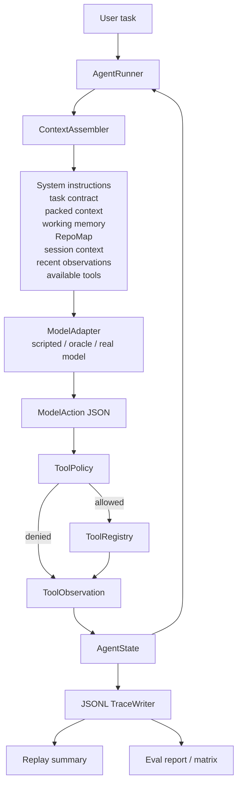
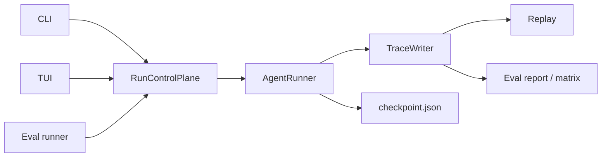
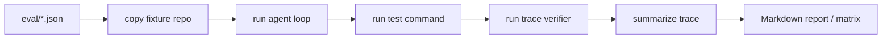

# HarnessCoder Architecture

HarnessCoder is a trace-backed coding agent harness. It keeps the agent loop
simple and dynamic while making every decision replayable and measurable.

## Core Loop



## Runtime Control Plane

HarnessCoder does not need a Hermes-style multi-platform Gateway. There is no
Telegram, Discord, email, or web ingress layer in the near-term roadmap. The
useful lesson is narrower: user entrypoints and the agent runtime should be
separated.

The local entrypoints are CLI, TUI, and eval runner. They should talk to a small
runtime control plane before touching the loop:



The first slice lives in `harnesscoder/core/control.py`. It centralizes
active-run decisions that used to be easy to scatter through UI code:

- a new run is blocked while another run is active;
- exit is blocked while a run is active until cancellation is implemented;
- only read-only slash commands such as `/help`, `/status`, and `/trace` are
  allowed during an active run.

Future run controls should grow from this runtime boundary, not as one-off TUI
branches. That includes live status, trace inspection, interrupt/cancel,
resume, approval prompts, and active-run protection. UI code can render the
decision, but the decision belongs to runtime control.

## Runtime Pieces

`AgentRunner` owns the loop. Each iteration assembles prompt context, asks the
model for one JSON action, checks policy, executes or denies a tool call, updates
state, writes a trace event, and saves a checkpoint.

`ModelAdapter` is deliberately small. `scripted` and `hc-bench-oracle` are local
control arms; `openai-codex` uses a Responses-style endpoint; `openai-chat` uses
a Chat Completions-style endpoint. All adapters must return the same
`ModelAction` shape. Codex Responses profiles may carry a runtime
`reasoning_effort` (`none|minimal|low|medium|high|xhigh`), which is normalized
inside the adapter, translated into the Responses `reasoning` payload, and
recorded in `run_started.model_metadata`. Chat Completions profiles do not
receive this field.

`ToolPolicy` is the gate before local effects. File tools must stay inside the
workspace, write/edit calls validate their arguments, test commands are narrow,
and broad shell control tokens are blocked.

`ToolRegistry` implements local tools:

- `read_file`
- `search_code`
- `repo_map`
- `write_file`
- `edit_file`
- `run_tests`
- `run_command`

## Durable Sessions

HarnessCoder supports task-oriented cross-run sessions for CLI/TUI follow-up
work. This is deliberately narrower than a general chat assistant memory. Each
agent run still receives a fresh `run_id`, writes its own trace, and can be
replayed independently.

`SessionStore` persists bounded turn summaries under
`.harnesscoder/sessions/<session_id>.json`. Before a session-backed run starts,
the runner loads a compact session context containing the session id, turn count,
summary, recent user messages, final answers, statuses, and trace paths. That
context is injected into prompt assembly and recorded through
`session_context_loaded` and `context_packed.session_context_injected`.

```text
durable session -> session_context -> AgentRunner.run(...)
single run -> trace/checkpoint/replay
completed run -> append bounded turn summary back to the session
```

Session context is also stored in `AgentState`, so checkpoints can resume a
session-backed run without silently dropping the cross-run context that was shown
to the model.

## Context Governance

Packed context summarizes recent observations, older trace history, modified
files, and remaining budget. It is available with `--context-mode pack`.

Task-local memory reduces tool results into scoped blocks:

- `task/failing_tests`
- `task/explored_files`
- `task/relevant_symbols`
- `task/patch_summary`
- `task/verified_facts`
- `task/open_questions`

RepoMap is the repository-level context layer. It extracts Python imports,
classes, functions, and signatures with `ast`, falls back to regex symbols for
other text files, ranks by query overlap, and renders under token/file bounds.
It avoids local secret-like files such as `.env` and `models.toml`.

Context Budget v2 makes prompt compaction explainable. Before each model call,
prompt assembly budgets named sections such as `system`, `task_contract`,
`packed_context`, `working_memory`, `repo_map`, `session_context`, and
`recent_observations`. The task contract is preserved; reducible sections can be
clipped or have older blocks dropped. The resulting `context_packed` event
records `context_budget.sections`, `context_reduced_sections`,
`context_dropped_blocks`, `context_budget_total_chars`, and
`context_budget_total_budget`.

## Trace And Replay

The trace is append-only JSONL. Important event types include:

- `run_started`
- `session_context_loaded`
- `context_packed`
- `repo_map_built`
- `repo_map_used`
- `model_action`
- `policy_decision`
- `tool_result`
- `memory_updated`
- `test_result`
- `verifier_result`
- `checkpoint_created`
- `run_finished`

Replay reconstructs final state and computes metrics such as tool calls,
repeated reads, invalid calls, policy denials, context tokens, context budget
reductions, dropped context blocks, compression count, memory updates, RepoMap
use, time to first edit, search-to-edit steps, and failure category.

## Eval Flow



HC-Bench-20 has bugfix, recovery, greenfield, context, and policy cases.
HC-Bench-40 keeps those cases comparable and adds harder heldout coverage:
ProgramBench-style programming repairs, parser recovery, richer greenfield
tasks, large-context lookup tasks, and policy/security cases. The oracle profile
proves the harness and verifier contracts are solvable before real-model
profiles are compared.

The context ablation matrix is an eval-facing view over the same runtime. It
runs the same cases with `full`, `no_repomap`, `no_memory`,
`no_context_compaction`, and `no_policy_retry`, then compares pass rate, tool
calls, repeated reads, invalid calls, policy denials, max-iteration failures,
context budget use, RepoMap use, first target read step, memory updates,
compression, and failure breakdown.
