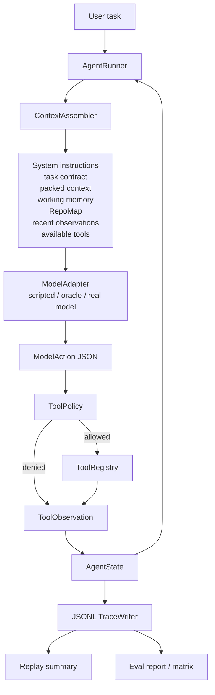
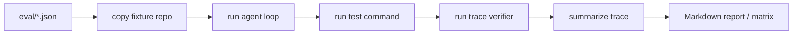

# HarnessCoder Architecture

HarnessCoder is a trace-backed coding agent harness. It keeps the agent loop
simple and dynamic while making every decision replayable and measurable.

## Core Loop

## Runtime Pieces

`AgentRunner` owns the loop. Each iteration assembles prompt context, asks the
model for one JSON action, checks policy, executes or denies a tool call, updates
state, writes a trace event, and saves a checkpoint.

`ModelAdapter` is deliberately small. `scripted` and `hc-bench-oracle` are local
control arms; `openai-codex` uses a Responses-style endpoint; `openai-chat` uses
a Chat Completions-style endpoint. All adapters must return the same
`ModelAction` shape.

`ToolPolicy` is the gate before local effects. File tools must stay inside the
workspace, write/edit calls validate their arguments, test commands are narrow,
and broad shell control tokens are blocked.

`ToolRegistry` implements local tools:

- `read_file`
- `search_code`
- `repo_map`
- `write_file`
- `edit_file`
- `run_tests`
- `run_command`

## Context Governance

Packed context summarizes recent observations, older trace history, modified
files, and remaining budget. It is available with `--context-mode pack`.

Task-local memory reduces tool results into scoped blocks:

- `task/failing_tests`
- `task/explored_files`
- `task/relevant_symbols`
- `task/patch_summary`
- `task/verified_facts`
- `task/open_questions`

RepoMap is the repository-level context layer. It extracts Python imports,
classes, functions, and signatures with `ast`, falls back to regex symbols for
other text files, ranks by query overlap, and renders under token/file bounds.
It avoids local secret-like files such as `.env` and `models.toml`.

## Trace And Replay

The trace is append-only JSONL. Important event types include:

- `run_started`
- `context_packed`
- `repo_map_built`
- `repo_map_used`
- `model_action`
- `policy_decision`
- `tool_result`
- `memory_updated`
- `test_result`
- `verifier_result`
- `checkpoint_created`
- `run_finished`

Replay reconstructs final state and computes metrics such as tool calls,
repeated reads, invalid calls, policy denials, context tokens, compression
count, memory updates, RepoMap use, time to first edit, search-to-edit steps, and
failure category.

## Eval Flow

HC-Bench-20 has bugfix, recovery, greenfield, context, and policy cases. The
oracle profile proves the harness and verifier contracts are solvable before
real-model profiles are compared.
