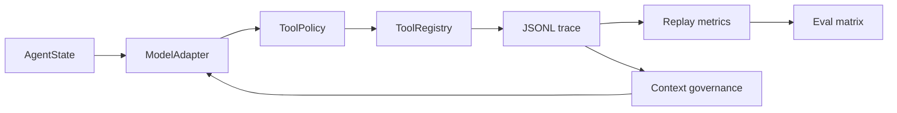

# HarnessCoder Showcase

HarnessCoder 1.0 is a trace-backed coding agent harness with real-model eval,
task-local memory, context compression, and repository-level context governance.

## What To Show

- Event-sourced loop: model decisions, policy checks, tool results, memory
  updates, checkpoints, and final status are written as JSONL trace events.
- Policy-gated tools: local effects pass through a small policy layer before
  execution.
- Trace/replay/eval: runs can be replayed and benchmarked into Markdown reports.
- Context governance: packed context, task-local memory, compression metrics,
  and RepoMap can be ablated.

## Current Evidence

HC-Bench-20 oracle baseline:

```text
Cases: 20
Passed: 20
Task success: 100.0%
Test pass: 100.0%
Verifier pass: 100.0%
```

Real-model matrix evidence:

```text
Profiles: hc_bench_oracle, scripted, deepseek
Cases: 20
deepseek provider: openai-chat
deepseek passed: 15.0% (3/20)
deepseek test pass: 75.0% (15/20)
deepseek verifier pass: 55.0% (11/20)
deepseek failure breakdown:
  model_error=3
  policy_denied=3
  success=3
  test_failed=1
  tool_failed=4
  verifier_failed=6
```

RepoMap ablation evidence with the deterministic oracle:

```text
pack + repo_map none:
  passed: 20/20
  context injections: 99
  RepoMap uses: 0
  RepoMap injections: 0
  estimated context tokens: 145770

pack + repo_map auto:
  passed: 20/20
  context injections: 99
  RepoMap builds: 47
  RepoMap uses: 99
  RepoMap injections: 99
  average first RepoMap target read step: 2
  estimated context tokens: 241646
```

The point of the ablation is not that the oracle becomes smarter. It proves the
harness can turn repository context governance on and off and report the change.

## Architecture

See [architecture.md](architecture.md) for the full diagram. The short version:



## Replay Example

Use the synthetic failure fixture:

```bash
python -m harnesscoder.replay examples/failure_replay_demo/synthetic_trace.jsonl
```

Important replay fields:

```json
{
  "run_id": "run_failure_demo",
  "failure_category": "test_failed",
  "modified_files": ["sample.py"],
  "tool_counts": {
    "edit_file": 1,
    "run_tests": 1
  }
}
```

## Failure Attribution Example

The failure replay demo records a plausible one-line edit followed by a focused
unit test failure. Replay classifies the run as `test_failed`, not merely
`failed`, because a `test_result` event shows the test command returned nonzero.
That gives the interview story a concrete debugging path:

```text
edit_file changed sample.py
run_tests returned exit code 1
test_result passed=false
failure_category=test_failed
```

For real-model HC-Bench-20, the matrix separates `model_error`, `policy_denied`,
`tool_failed`, `test_failed`, and `verifier_failed`. This is the difference
between "the agent failed" and "we know which layer failed."

## Reproduce

```bash
python -m unittest discover -s tests

python -m harnesscoder \
  --provider hc-bench-oracle \
  --eval eval/hc_bench_20.json \
  --max-iterations 8 \
  --eval-report .harnesscoder/reports/hc-bench-20-oracle.md

python -m harnesscoder \
  --model-config models.toml \
  --model-profiles hc_bench_oracle,scripted,deepseek \
  --context-mode pack \
  --eval eval/hc_bench_20.json \
  --max-iterations 8 \
  --eval-report .harnesscoder/reports/hc-bench-20-real-matrix.md
```

Keep `models.toml` and `.env` local. Public docs should show environment
variable names, not real keys or private endpoints.
